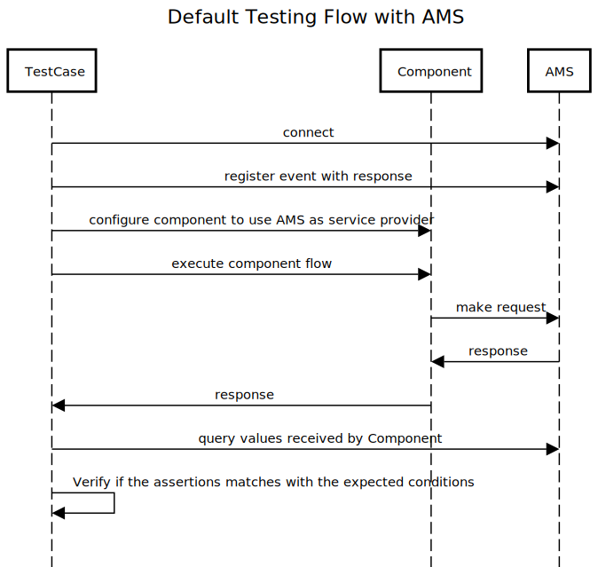

# Api Mock Server (AMS)

## Introduction

The AMS acts as a regular API server, with objective to mock the 3rd party API servers, returning expected (or unexpected) responses, allowing the integration tests verify the behaviour of its components with more accuracy. 

### Glossary

- **API Mock Server** - This project.
- **Application** - The software that will be tested.
- **Component** - The Application's class, module, function or even service that will be tested.
- **Request** - A REST Request. 
- **TestCase** - script written by developer or QA, which perform operations over Application's Components, to verify if the acceptance criteria and requirements are met. 

### How it works

- like any other. It receives a REST API request, and returns a response. But this process is coordinated by a TestCase, which connects to AMS, and set what should be returned when the Component send a certain Request to it. 
- The AMS waits until receives any request that matches with the pre-defined by the TestCase, and then proceeds as planned, returning the response to the Component.
- The Component receives the response, and proceed normally, until it finishes the flow, and return the control to TestCase.
- Now the TestCase verify if the response is what was expected.
    - Moreover, the TestCase may query the AMS, to verify if the requested data matches with the expected values as well.
    - Furthermore, the AMS may be configured to acting like in error conditions, such as resetting the connection, or sending some errors. This is especifically usefull when verifying edge cases, very hard to test in normal conditions.

### Example

### Use Cases

Some use cases of using AMS are:

- Emulate 3rd party services, such as payment gateways and messaging servers (email, SMS, push notification) for example. Instead of test directly on 3rd party service provider endpoint, it is possible to add an intermediate step, testing some edge cases and even the "happy flows" using the AMS.
- Verify how the Component behaves when the 3rd party service fails. 
- Validate if the data sent to 3rd party service provider matches with the expected.

### Advantages

You may be asking why to use something like this, instead to simply mock the components during the integration tests. The answer is that sometimes is hard to catch some error conditions, especially in flows that perform multiple requests to different service providers (or internal microservices), and some fail happens in the middle of a request. Sometimes it may be caused by a glitch in the network, or even some failure in an external component. This can take a lot of time from the developer, to debug and at the end, realize that the problem is not in theirs Component, but in something else. So, some advantages propposed by AMS are:  

- Allow developers perform integration tests having a real API server to call, instead to mock programatically the code;
- Agnostic -  it is not tied to any technology. 
- Query intermediate requests data - get the data send from the Component to the API
- Test "Bad flows" - Test cases like timeouts, connections reset, HTTP errors (500, 400, etc)

